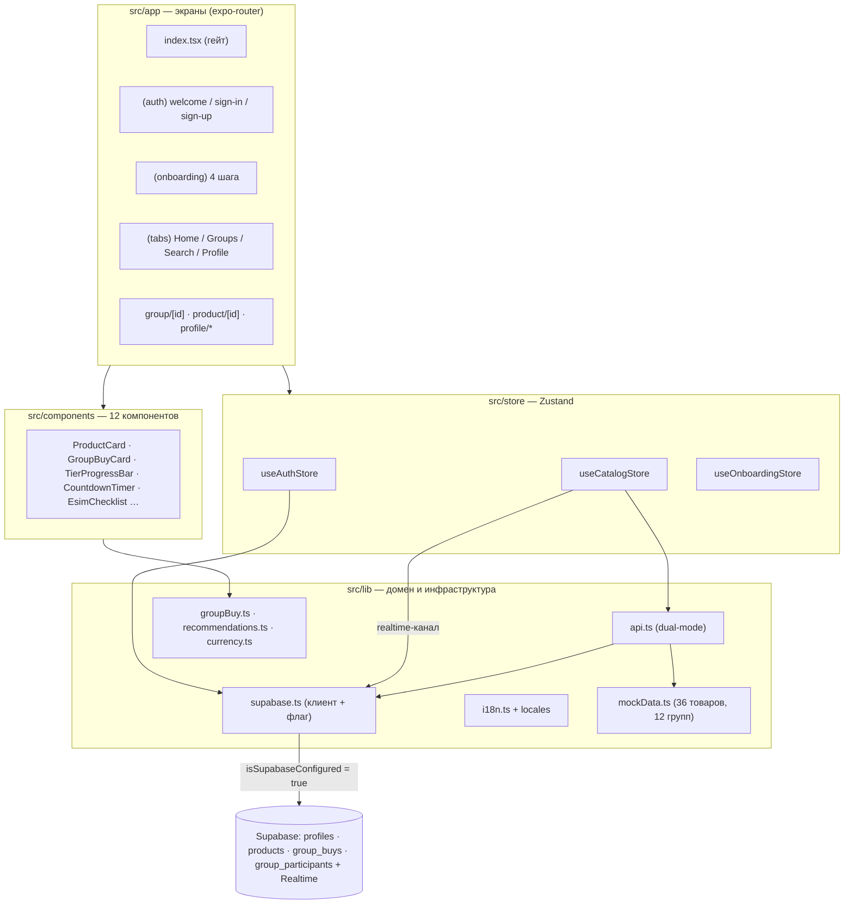
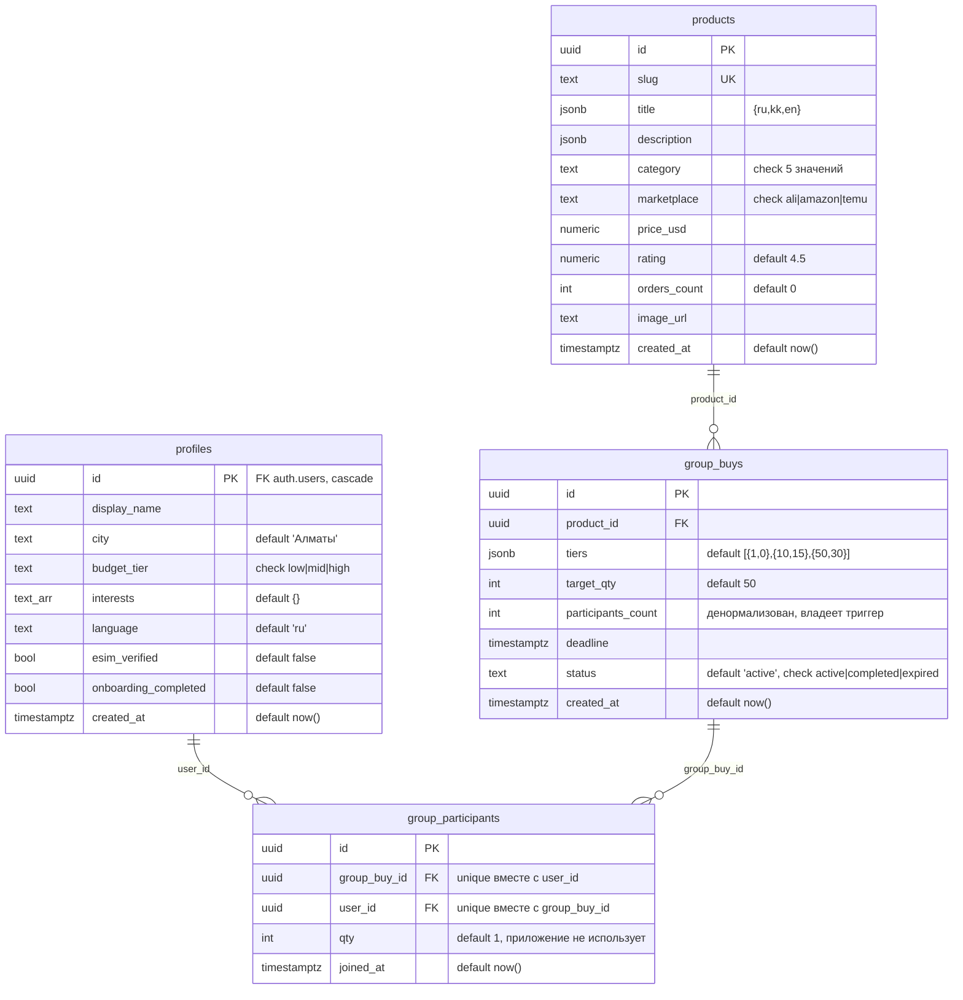
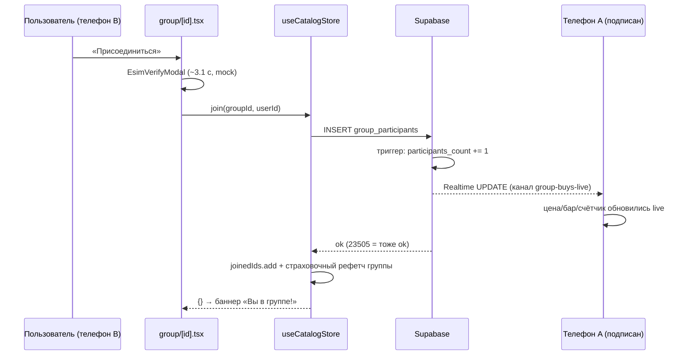

# Topar — продуктово-архитектурный документ

> **Topar** (с казахского — «группа») — мобильный маркетплейс групповых покупок для Казахстана.
> Хакатонный MVP: Expo SDK 54 · React Native 0.81 · expo-router 6 · Zustand · Supabase (Auth, Postgres, Realtime) · i18next (RU/KK/EN).
>
> Документ составлен по полному аудиту кодовой базы (87 файлов в git, ветка `master`, июнь 2026).

---

## Содержание

1. [Резюме](#1-резюме)
2. [Продукт](#2-продукт)
3. [Пользовательские сценарии](#3-пользовательские-сценарии)
4. [Техническая архитектура](#4-техническая-архитектура)
5. [Доменная логика и формулы](#5-доменная-логика-и-формулы)
6. [Дизайн-система и UI-компоненты](#6-дизайн-система-и-ui-компоненты)
7. [Локализация](#7-локализация)
8. [Конфигурация и инфраструктура](#8-конфигурация-и-инфраструктура)
9. [Безопасность и приватность](#9-безопасность-и-приватность)
10. [Известные проблемы и технический долг](#10-известные-проблемы-и-технический-долг)
11. [Рекомендации и роадмап](#11-рекомендации-и-роадмап)

---

## 1. Резюме

**Что это.** Topar — приложение коллективных покупок в духе Pinduoduo/Temu Team Buy, локализованное под Казахстан. Оно агрегирует товары глобальных маркетплейсов (AliExpress, Amazon, Temu — пока mock-данные), показывает цены в тенге и позволяет вступать в ограниченные по времени «группы»: чем больше участников, тем ниже цена (1 чел. = розница, 10+ = −15 %, 50+ = −30 %).

**Слоган** (экран приветствия): *«Покупаем вместе — платим меньше»* — «Товары мировых маркетплейсов с групповыми скидками до 30 % и доставкой в Казахстан».

**Дифференциатор** — концептуальный trust-слой «eSIM-идентичность»: *«один человек = одно устройство = одно место в группе»*, защита групп от ботов и накрутки. В MVP реализован как честно подписанная UI-анимация без реальной интеграции с операторами.

**Состояние продукта.** Полнофункциональное демо: приложение работает end-to-end в двух режимах — полностью офлайн на встроенных mock-данных (36 товаров, 12 групп) либо против реального Supabase-проекта с live-обновлениями между устройствами через Postgres Realtime. Платежи, логистика, реальные API маркетплейсов и реальная eSIM-верификация отсутствуют осознанно (зафиксировано в README как границы MVP).

**Ключевые цифры кодовой базы:**

| Метрика | Значение |
|---|---|
| Экранов (маршрутов) | 16 + 4 layout-файла |
| UI-компонентов | 12 |
| Zustand-сторов | 3 (auth, catalog, onboarding) |
| Таблиц в БД | 4 (`profiles`, `products`, `group_buys`, `group_participants`) |
| Языков | 3 (ru — основной/fallback, kk, en), ~118–122 ключа на локаль |
| Mock-каталог | 36 товаров × 5 категорий, 12 групповых закупок |
| Зависимостей (runtime) | 33, из них ~6 не используются (наследие шаблона) |

---

## 2. Продукт

### 2.1 Ценностное предложение

Topar встраивается между покупателем из Казахстана и зарубежными маркетплейсами и снижает цену за счёт объёма: участники объединяются в группу на конкретный товар, и при пересечении порогов численности скидка растёт для всех. Экономика (никогда не проговоренная в коде, но единственный экономический артефакт UI) — спред между «ценой в одиночку» и групповой ценой.

### 2.2 Целевая аудитория и рыночные сигналы

Таргетинг на Казахстан зашит в продукт повсеместно:

- **Валюта** — все цены в ₸ (KZT), фиксированный курс `1 USD = 512 ₸` (`src/lib/currency.ts:1`), округление до 10 ₸ «чтобы цены выглядели как настоящие ценники».
- **Языки** — русский (основной и универсальный fallback), казахский, английский; трёхъязычный контент товаров (JSONB `{ru, kk, en}`).
- **Города** — онбординг предлагает ровно 5 городов: Алматы (по умолчанию), Астана, Шымкент, Қарағанды, Ақтөбе (`src/lib/constants.ts:11`).
- **Бюджеты в тенге** — «Эконом: до 10 000 ₸», «Средний: 10 000–50 000 ₸», «Премиум: свыше 50 000 ₸» (внутри маппятся на USD-диапазоны <$20 / $20–100 / >$100).
- **Кросс-бордер позиционирование** — бейджи источников только AliExpress / Amazon / Temu (локальных Kaspi/Wildberries/Ozon в коде нет); на карточке товара: «✈️ Доставка из-за рубежа · 10–15 дней».

Портрет пользователя, который следует из каталога: чувствительный к цене масс-маркет (большинство товаров $8–60 — наушники, худи, аэрогрили, коврики для йоги), привыкший к AliExpress/Temu, в пяти крупнейших городах РК.

### 2.3 Ключевая механика — групповая покупка

- У каждой группы есть **лестница уровней** (tiers): по умолчанию `1 чел. → 0 %`, `10+ → −15 %`, `50+ → −30 %`; цель `target_qty = 50` участников совпадает с верхним порогом.
- **Дедлайн** — у каждой группы таймер обратного отсчёта (краснеет при < 6 ч до конца); по истечении группа считается завершённой.
- **Живой счётчик** — `participants_count` обновляется на всех устройствах в реальном времени; присоединение другого пользователя анимирует прогресс-бар и может на глазах уронить цену через порог.
- **Фиксация цены** — после вступления баннер «Вы в группе! Цена зафиксирована: …» (семантика фиксации — только UI, серверного механизма нет).
- Выход из группы возможен в любой момент, пока группа активна (после дедлайна кнопка выхода заменяется на неактивную «Сбор завершён»); вступление идемпотентно (повторное — no-op).

### 2.4 Trust-слой: eSIM-идентичность (концепт)

Заявка: eSIM как «цифровой паспорт покупателя» — оператор подтверждает, что номер активен и привязан к данному устройству, приложение получает подписанный identity-токен без паролей и SMS, отсюда «честные группы: один человек = одно устройство = одно место, боты и накрутка исключены».

Фактическая реализация:

| Точка | Что происходит |
|---|---|
| Онбординг, шаг 4 (`esim-verify`) | Анимация-чеклист из 3 шагов («Запрос к оператору…» → «Чтение eSIM-профиля…» → «Привязка устройства…») по 800 мс; через ~3,1 с в профиль пишется `esim_verified: true` |
| Перед каждым вступлением в группу | Та же анимация в модалке `EsimVerifyModal` (без кнопки отмены), затем автоматически выполняется join |
| Профиль | Бейдж «Верифицирован через eSIM» (синий щит) |
| Экран `profile/sim-identity` | Статический 4-шаговый эксплейнер концепции + плашка roadmap |

Важно: продукт **честен** — в обоих местах рендерится дисклеймер «Концепт будущей интеграции — без реального подключения к оператору», а компонент прямо задокументирован как «Pure UI — no real telecom calls». При этом флаг `esim_verified` нигде ничего не гейтит — join не проверяет его.

### 2.5 Зрелость: что реально, что замокано, что заглушка

- **Реально работает:** навигация и гейтинг, auth + персистентность сессии (Supabase или AsyncStorage), 4-шаговый онбординг, скоринг ленты, поиск/фильтры, вступление/выход из групп (подтверждение сервером → обновление состояния → страховочный рефетч), Postgres-схема с RLS/триггером/Realtime, переиспользуемый seed-скрипт, каунтдауны, анимации, i18n с плюрализацией.
- **Замокано (фейковые данные, настоящий UX):** весь каталог (36 товаров с выдуманными брендами, картинки `picsum.photos/seed/{slug}/600/600`), 12 групп (11 активных с дедлайнами +5 ч…+3 дня, 1 намеренно истёкшая), eSIM-проверка, курс валюты.
- **Заглушки/отсутствует:** покупка в одиночку (`Alert` «Демо: заказ по обычной цене оформлен»), платежи, доставка/логистика, реальные API маркетплейсов, реальная eSIM-интеграция, ML-рекомендации, история заказов, push-уведомления, жизненный цикл статуса `completed` (значение есть в типе и схеме, но никто его не выставляет).

### 2.6 Монетизация

Не реализована ни в каком виде: нет платёжных SDK, чекаута, комиссий, рекламы. Подразумеваемая модель — маржа агрегатора на объёмных заказах.

---

## 3. Пользовательские сценарии

### 3.1 Холодный старт и гейтинг

Весь гейтинг сосредоточен в **одном** файле — `src/app/index.tsx` (комментарий в коде: «The single place where auth/onboarding gating happens (avoids redirect loops)»):

```
status === 'loading'      → фирменный сплэш (#FF5A1F, логотип «Topar», спиннер)
status === 'signedOut'    → Redirect /(auth)/welcome
signedIn, онбординг не завершён → Redirect /(onboarding)/interests
иначе                     → Redirect /(tabs)
```

Цвет сплэша в `app.json` совпадает с цветом этого экрана — переход с нативного сплэша бесшовный.

### 3.2 Регистрация и онбординг

1. **Welcome** — выбор языка (пилюли РУС/ҚАЗ/ENG, пишется в AsyncStorage `topar.lang`), кнопки «Создать аккаунт» / «Войти».
2. **Sign-up** — имя + email + пароль ≥ 6 символов. **Sign-in** — email + пароль; после входа маршрут зависит от `onboarding_completed` в профиле.
3. **Онбординг, 4 шага** (выбор живёт в эфемерном `useOnboardingStore`, в память):
   - *Интересы* — мультивыбор из 5 категорий (📱 Электроника, 👟 Мода, 🏠 Дом, 💄 Красота, 🏋️ Спорт); «Продолжить» активна при ≥ 1.
   - *Бюджет* — одиночный выбор 💸/💳/💎; обязателен.
   - *Город* — список из 5 городов, Алматы предвыбран.
   - *eSIM-верификация* — автозапускается mock-чеклист; через ~3,1 с весь онбординг атомарно сохраняется одним `updateProfile({interests, budget_tier, city, language, esim_verified: true, onboarding_completed: true})`, после чего «Продолжить» ведёт в `/(tabs)`.

### 3.3 Основной цикл

```
Главная (лента «Для вас» + рейл «🔥 Горячие группы»)
   │ тап по товару
   ▼
Карточка товара  ── цена «в одиночку» vs лучшая групповая (−30 %), экономия в ₸
   │ «Присоединиться к группе»            │ нет группы → «Купить по обычной цене» (демо-Alert)
   ▼
Экран группы  ── живая цена текущего уровня, лестница уровней, прогресс-бар
   │           с маркерами порогов, «Ещё N чел. до −15 %», каунтдаун
   │ «Присоединиться»
   ▼
EsimVerifyModal (~3,1 с)  →  join  →  баннер «Вы в группе! Цена зафиксирована»
   │
   ▼
Realtime: на всех устройствах счётчик участников, бар и цена обновляются без рефреша
```

Остальные табы: **Группы** — все закупки (активные по ближайшему дедлайну, истёкшие в конце с прозрачностью 0.55); **Поиск** — текст + чипы категорий; **Профиль** — аватар-инициалы, бейдж верификации, чипы интересов, меню (язык / SIM-идентификация / выход), «Мои группы».

### 3.4 Сценарий демо («wow-момент» из README)

Группа «Беспроводные наушники TWS Pro» **специально засеяна на 9/10 участников** (комментарии и в `mockData.ts`, и в `seed.sql`). На сцене телефон B вступает в группу через eSIM-проверку, телефон A без рефреша видит: счётчик 9 → 10, анимацию прогресс-бара и падение цены через порог −15 %. `seed.sql` безопасно перезапускать перед каждым демо — он пересоздаёт каталог и освежает дедлайны, не трогая профили.

---

## 4. Техническая архитектура

### 4.1 Стек и общая схема

| Слой | Технология |
|---|---|
| Платформа | Expo SDK 54 (managed, CNG — нативных папок в git нет), React Native 0.81.5, React 19.1.0, TypeScript 5.9 strict |
| Навигация | expo-router ~6.0.24 (file-based, typed routes), вход `"main": "expo-router/entry"` |
| Состояние | Zustand 5 — три стора без middleware |
| Бэкенд | Supabase (`@supabase/supabase-js` ^2.108) — Auth, Postgres, Realtime; либо встроенный mock-режим |
| Локализация | i18next 26 + react-i18next 17 + intl-pluralrules + expo-localization |
| Хранилище | AsyncStorage (сессия Supabase, язык, mock-профиль) |
| Эксперименты | `typedRoutes: true`, `reactCompiler: true` (автомемоизация всего проекта) |



### 4.2 Структура проекта

```
topar/
├── app.json                  # Expo-конфиг (схема topar://, сплэш #FF5A1F, web: single)
├── package.json              # main: expo-router/entry
├── tsconfig.json             # strict, алиасы @/* → src/*, @/assets/* → assets/*
├── .env                      # не в git (.gitignore); EXPO_PUBLIC_SUPABASE_URL / _ANON_KEY
├── assets/                   # иконки/сплэш (пока — шаблонные ассеты Expo, см. §6.3)
├── supabase/
│   ├── migrations/0001_schema.sql   # таблицы, RLS, триггер счётчика, Realtime
│   └── seed.sql                     # 36 товаров + 12 групп, перезапускаемый
└── src/
    ├── app/                  # маршруты (см. §4.3)
    ├── components/           # 12 переиспользуемых компонентов
    ├── store/                # useAuthStore, useCatalogStore, useOnboardingStore
    ├── hooks/useCountdown.ts
    ├── lib/                  # api, supabase, i18n, theme, types, constants,
    │                         # groupBuy, recommendations, currency, mockData
    └── locales/{ru,kk,en}.json
```

### 4.3 Навигация (expo-router)

```
Stack (root, src/app/_layout.tsx — headerShown: false везде)
├── /                       index.tsx            ← единственный гейт auth/онбординга
├── (auth)/                 Stack
│   ├── /welcome            язык + вход/регистрация
│   ├── /sign-in            email+пароль
│   └── /sign-up            имя+email+пароль
├── (onboarding)/           Stack — шаги через router.push (жест «назад» работает)
│   ├── /interests  /budget  /city  /esim-verify
├── (tabs)/                 Tabs (Ionicons, активный цвет #FF5A1F)
│   ├── /          Home     рейл горячих групп + персональная лента 2 колонки
│   ├── /groups             все закупки
│   ├── /search             текст + чипы категорий
│   └── /profile            профиль + «Мои группы»
├── /group/[id]             детальная группа (live-цена, лестница, join/leave)
├── /product/[id]           детальный товар (цены, группа, описание)
├── /profile/language       выбор языка
└── /profile/sim-identity   эксплейнер eSIM-концепции
```

Архитектурные решения:

- **Один гейт.** Редиректы по auth/онбордингу выполняет только `/`; остальные экраны гардов не имеют (см. риски в §10).
- **Бутстрап данных в layout табов.** `(tabs)/_layout.tsx` — единственное место бутстрапа: там один раз вызываются первичный `load()`, `subscribeLive()` (одна realtime-подписка на всё приложение, отписка в cleanup) и `refreshJoined(userId)`; помимо этого `load` дёргается pull-to-refresh'ем на Home и Groups.
- **Детальные экраны читают группу из стора**, поэтому realtime-тики `participants_count` перерисовывают их автоматически.
- Кастомные кнопки «назад» (`router.back()`) — нативных хедеров нет нигде.

### 4.4 Управление состоянием

Три плоских Zustand-стора (без persist-middleware — персистентность ручная или делегирована supabase-js):

| Стор | Состояние | Действия | Персистентность |
|---|---|---|---|
| `useAuthStore` | `status: 'loading'\|'signedOut'\|'signedIn'`, `userId`, `profile` | `init`, `signUp`, `signIn`, `signOut`, `updateProfile` | Supabase-сессия — самим supabase-js в AsyncStorage; mock-профиль — ключ `topar.mock.profile` |
| `useCatalogStore` | `products`, `groups`, `joinedIds: Set`, `loading`, `error` | `load`, `refreshJoined`, `join`, `leave`, `subscribeLive` | нет (загружается при старте) |
| `useOnboardingStore` | `interests`, `budget`, `city` ('Алматы' по умолчанию) | `toggleInterest`, `setBudget`, `setCity`, `reset` | нет (только память) |

Связывание сторов — **только через экраны** (сторы друг друга не импортируют):
- `_layout.tsx` (root) вызывает `auth.init()` один раз;
- `(tabs)/_layout.tsx` передаёт `auth.userId` в `catalog.refreshJoined`;
- `esim-verify.tsx` сливает `useOnboardingStore.getState()` в `auth.updateProfile()` — единственная точка пересечения.

Паттерны обновления: `joinedIds` — server-confirmed-then-set (сначала успех мутации, потом Set); `updateProfile` — наоборот, истинно оптимистичный (локальный set до I/O, ошибка Supabase не проверяется — см. §10).

### 4.5 Слой данных: dual-mode

Единственный флаг режима (`src/lib/supabase.ts:10`):

```ts
export const isSupabaseConfigured = url.startsWith('https://') && anonKey.length > 20;
```

Отсутствующий или пустой `.env` (файл гитигнорится; в рабочей копии лежит пустой шаблон, в свежем клоне его нет вовсе) ⇒ `false` ⇒ **офлайн-демо-режим**: каждая функция `api.ts` и каждая ветка сторов сворачивает на встроенные данные. Клиент Supabase при этом всё равно создаётся (на placeholder-URL, с опциями `persistSession: true`, `autoRefreshToken: true`, `detectSessionInUrl: false`, хранилище — AsyncStorage), чтобы импорт модуля никогда не падал; реальные вызовы всегда защищены флагом. На нативных платформах при настроенном Supabase модуль вешает AppState-слушатель (официальный RN-сниппет): авто-обновление токенов работает только пока приложение в foreground. Переменные `EXPO_PUBLIC_*` инлайнятся при сборке — смена `.env` требует `npx expo start -c`.

**API-поверхность (`src/lib/api.ts`)** — у fetch-функций контракт «бросить исключение», у мутаций — «вернуть `{error?}`»:

| Функция | Supabase-режим | Mock-режим |
|---|---|---|
| `fetchProducts()` | `products` order by `orders_count desc` | `MOCK_PRODUCTS` |
| `fetchGroupBuys()` | `group_buys` + вложенный `product:products(*)`, order by `deadline asc` | копии `mockDb.groups` |
| `fetchGroupBuy(id)` | то же по id, `maybeSingle` | поиск в `mockDb` |
| `fetchMyGroupIds(userId)` | `group_participants` по `user_id` → `Set` | `new Set(mockDb.joined)` |
| `joinGroup(groupId, userId)` | insert в `group_participants`; код Postgres `23505` (уже в группе) считается успехом | `mockDb.join()` |
| `leaveGroup(groupId, userId)` | delete по паре ключей | `mockDb.leave()` |

**MockDb** — in-memory синглтон со списком слушателей: `join`/`leave` мутируют `participants_count` и эмитят событие, так что «realtime»-ощущение сохраняется даже офлайн (на одном устройстве). Mock-id — слаги (`id = slug`, группы `gb-<slug>`), в отличие от uuid в Supabase.

**Live-обновления:** канал `supabase.channel('group-buys-live')` с одной подпиской `postgres_changes UPDATE on public.group_buys`; обработчик вливает `payload.new` в нужную группу, сохраняя ранее вложенный `product` (raw-строка таблицы джойна не содержит). После собственного join/leave стор дополнительно делает страховочный рефетч одной группы «на случай неработающего Realtime».

### 4.6 База данных (supabase/migrations/0001_schema.sql)



Ключевые механизмы:

- **Триггер-счётчик.** `sync_participants_count()` (plpgsql, `SECURITY DEFINER`) после INSERT/DELETE в `group_participants` обновляет `group_buys.participants_count` (`greatest(count ± 1, 0)`). SECURITY DEFINER обязателен: у пользователей нет UPDATE-политики на `group_buys`. Дизайн-цель из комментария в SQL: «Realtime эмитит ровно один чистый UPDATE по group_buys на каждый join/leave».
- **Realtime-публикация.** `alter publication supabase_realtime add table public.group_buys` — публикуется только эта таблица.
- **RLS** (включён на всех 4 таблицах, 8 политик; в SQL прямо помечено «hackathon posture»): все чтения публичные (`using (true)`); запись — только своя строка `profiles` (insert/update по `auth.uid() = id`; политика update задана через `USING` без явного `WITH CHECK` — Postgres в этом случае применяет USING-выражение и к новым строкам, так что это эквивалент полной формы) и свои строки `group_participants` (insert/delete по `auth.uid() = user_id`). На `products`/`group_buys` write-политик нет — каталог управляется только из SQL-редактора/service role.
- **Уникальность участия.** `unique (group_buy_id, user_id)` — техническое воплощение обещания «одно место в группе»; нарушение (23505) клиент трактует как успех.
- **seed.sql** — безопасно перезапускаемый (каждый прогон пересоздаёт каталог с новыми uuid и свежими дедлайнами и стирает все вступления): чистит каталог в FK-безопасном порядке (профили не трогает) и вставляет тот же каталог из 36 товаров и 12 групп, что и mock-данные (наушники — 9/10 участников, очки — истёкшая 2 ч назад; единственное текстовое расхождение с mock — формулировка описания mini-projector).

### 4.7 Сквозной поток «вступить в группу» (Supabase-режим)



В mock-режиме та же цепочка схлопывается до `mockDb.join → emit → стор копирует состояние MockDb`.

### 4.8 Политика UI-состояний (loading / error / empty)

Централизованной политики нет; фактическая картина (важно для доработок):

- **Loading:** полноэкранный — только сплэш гейта; `RefreshControl` на Home/Groups (крутится только при пустом кэше: `loading = products.length === 0`); спиннеры внутри `PrimaryButton`. Скелетонов нет. Search/Profile/детальные экраны состояния загрузки не имеют.
- **Error — ровно 3 поверхности на всё приложение:** красный текст в sign-in и sign-up (включая сырое английское сообщение Supabase) и один `Alert` при ошибке join. Всё остальное молчит: поле `useCatalogStore.error` пишется, но **не читается ни одним компонентом** (ключ `common.error` в локалях существует и не используется); ошибка leave отбрасывается; ошибка `updateProfile` игнорируется.
- **Empty/not-found:** единый компонент `EmptyState` (эмодзи + строка, без кнопки retry). Строка `search.noResults` перегружена: означает и пустую ленту, и «товар не найден», и «группа не найдена», и де-факто загрузку при deep-link на детальный экран (загрузка маскируется под not-found, а в этой ветке нет даже кнопки «назад»).

---

## 5. Доменная логика и формулы

### 5.1 Модель данных (`src/lib/types.ts`)

Поля в snake_case — они же имена колонок Supabase:

```ts
Lang          = 'ru' | 'kk' | 'en'
LocalizedText = { ru: string; kk?: string; en?: string }   // ru обязателен
Category      = 'electronics' | 'fashion' | 'home' | 'beauty' | 'sports'
Marketplace   = 'aliexpress' | 'amazon' | 'temu'
BudgetTier    = 'low' | 'mid' | 'high'

Product  { id, slug, title: LocalizedText, description?, category, marketplace,
           price_usd, rating, orders_count, image_url }
Tier     { min_qty: number; discount_pct: number }
GroupBuy { id, product_id, tiers: Tier[], target_qty, participants_count,
           deadline: string /* ISO */, status: 'active'|'completed'|'expired',
           product?: Product }
Profile  { id, display_name, city, budget_tier: BudgetTier|null,
           interests: Category[], language: Lang,
           esim_verified: boolean, onboarding_completed: boolean }
```

### 5.2 Механика ценовых уровней (`src/lib/groupBuy.ts`)

Все функции сортируют tiers по `min_qty` по возрастанию; число участников клампится: `n = max(participants, 1)` — пустая группа оценивается «как будто вы первый».

| Функция | Формула |
|---|---|
| `currentTier(tiers, p)` | последний tier с `min_qty <= n` (fallback — самый нижний) |
| `nextTier(tiers, p)` | первый tier с `min_qty > n`, иначе `null` |
| `gapToNext(tiers, p)` | `next.min_qty - participants` (сырое значение, без клампа) |
| `discountedUsd(price, tier)` | `price * (1 - discount_pct / 100)` |
| `currentPriceUsd(price, tiers, p)` | композиция двух предыдущих — живая цена на карточках |
| `bestTier(tiers)` | tier с максимальным `min_qty` (максимальная скидка) |
| `progress(p, target)` | `target <= 0 ? 0 : min(p / target, 1)` |
| `isExpired(group, now)` | `status !== 'active' \|\| deadline <= now` — единый источник «живости» |

Переходов статуса в коде **нет**: ничто никогда не пишет `status`; истечение — чисто клиентская производная от дедлайна.

### 5.3 Алгоритм рекомендаций (`src/lib/recommendations.ts`)

Лента «Для вас» — линейный скоринг (веса в сумме 1.0 + тайбрейкер):

```
score = 0.40 · interestMatch      // категория ∈ интересы профиля → 1, иначе 0
      + 0.20 · budgetFit          // та же ценовая полоса → 1; соседняя → 0.4;
                                  // через одну → 0; бюджет не задан → 0.5
      + 0.25 · popularity         // 0.6·min(log10(orders+1)/5, 1) + 0.4·(rating/5)
      + 0.15 · groupBoost         // живая группа: 0.5 + 0.5·progress; нет/истекла: 0
      + 0.001· jitter(id)         // детерминированный хеш id ∈ [0,1) — разбивает кластеры категорий
```

Полосы бюджета: `low < $20`, `mid $20–100`, `high ≥ $100` (≈ границы 10 000 ₸ / 50 000 ₸ при курсе 512). Логарифм в popularity сознательно не даёт бестселлеру на 80 000 заказов задавить всё остальное. На Home ранжирование намеренно **не** пересчитывается на realtime-тиках (группы читаются через ref) — лента не перетасовывается под пальцем; «🔥 Горячие группы» — топ-3 живых групп по заполненности.

### 5.4 Валюта (`src/lib/currency.ts`)

- `USD_TO_KZT = 512` — фиксированный курс (ограничение MVP, признано в README).
- `usdToKzt(usd) = round(usd · 512 / 10) · 10` — округление до 10 ₸.
- `formatKZT(usd)` → строка вида `10 230 ₸` (ручная группировка пробелами — `Intl` на Hermes нестабилен); `formatKztAmount(kzt)` — то же для уже-тенговых сумм (экономия на детальных экранах). USD пользователю не показывается нигде.

### 5.5 Константы (`src/lib/constants.ts`)

- `CATEGORIES` — 5 категорий с эмодзи (порядок задаёт порядок чипов в UI).
- `CITIES` — 5 городов РК.
- `BUDGET_TIERS` / `BUDGET_BANDS` — см. §5.3.
- `MARKETPLACES` — стили бейджей: AliExpress `#FFE9E2/#D02804`, Amazon `#E8EDF4/#232F3E`, Temu `#FFF3E0/#E07000`.
- В mock-слое (`src/lib/mockData.ts`): `DEFAULT_TIERS = [{1,0},{10,15},{50,30}]`, `target_qty = 50` у всех групп — зеркалят дефолты колонок в БД.

---

## 6. Дизайн-система и UI-компоненты

### 6.1 Токены (`src/lib/theme.ts`)

Без тем и контекста — константы импортируются напрямую. Только светлая тема (`userInterfaceStyle: "light"`).

**Язык палитры:** тёплый оранжевый — бренд и действия; зелёный — «деньги/скидка/прогресс»; синий — зарезервирован под eSIM-идентичность; тёмно-синий текст на тёплой «бумаге».

| Группа | Токены |
|---|---|
| Бренд | `primary #FF5A1F` · `primaryDark #E04A12` · `primarySoft #FFF0E8` |
| Сделка/успех | `success #16A34A` · `successSoft #E8F7EE` |
| Поверхности | `bg #F7F6F3` · `card #FFFFFF` · `border #ECEAE4` |
| Текст | `text #1A1D29` · `textSecondary #6B7080` · `textMuted #9CA0AC` |
| Сигналы | `danger #DC2626` · `warning #D97706` |
| eSIM | `esim #2563EB` · `esimSoft #EBF1FE` |
| Прочее | `overlay rgba(16,18,27,0.55)` |

Spacing `4/8/12/16/24/32`, radius `8/12/16/24/999`, `shadow.card` (мягкая, opacity 0.06, elevation 2), typography из 5 стилей (на практике используется мало — большинство размеров шрифта заданы инлайн).

### 6.2 Компоненты (`src/components/`, 12 шт.)

| Компонент | Назначение |
|---|---|
| `ScreenContainer` | SafeAreaView-обёртка каждого экрана (edges top/left/right; `padded` по умолчанию) |
| `PrimaryButton` | Кнопка 52 px, варианты `primary/outline/success/danger`, состояния disabled/loading |
| `CategoryChip` | Пилюля категории (онбординг-интересы, фильтры поиска) |
| `ProductCard` | Карточка товара для 2-колоночных сеток: фото, бейдж маркетплейса, ★рейтинг, заказы, цена в ₸, зелёная пилюля «Группа −N %» при живой группе |
| `GroupBuyCard` | Карточка группы: живая цена (зелёная) + зачёркнутая розница, 👥 участники, каунтдаун, компактный прогресс-бар, ✓-пилюля «вы в группе», дим 0.55 для истёкших |
| `TierProgressBar` | Анимированный бар (600 мс) с маркерами-точками на порогах tiers и подписями −N % (зеленеют при достижении) |
| `CountdownTimer` | `Д Ч:М:С` с tabular-nums, тик 1 с, красный при < 6 ч, «Сбор завершён» по истечении |
| `MarketplaceBadge` | Цветная пилюля источника (AliExpress/Amazon/Temu) |
| `VerifiedBadge` | Синий щит «Верифицирован через eSIM» / серый «Без верификации» |
| `EmptyState` | Эмодзи + строка; единый ответ на пустоту/не-найдено (без действия) |
| `EsimChecklist` | Mock-анимация верификации: 3 шага × 800 мс, пульсирующий чип → зелёный щит, `onDone` через ~3,1 с |
| `EsimVerifyModal` | Прозрачная модалка с чеклистом перед каждым join (без отмены) |

Соглашения: все строки — через i18n; контент товаров — через `lt()`; цены — только `formatKZT`; иконки — Ionicons + эмодзи; изображения — `expo-image` c fade 150 мс (200 мс на hero-фото детального экрана товара); анимации — core `Animated` (reanimated установлен, но не используется).

### 6.3 Брендинг и ассеты — критический разрыв

In-app бренд (оранжевый #FF5A1F) **не совпадает с OS-уровнем**: все иконки приложения — стоковый сине-голубой шеврон Expo из шаблона create-expo-app (`#007AFF`-семейство, включая Icon Composer-документ `assets/expo.icon` для iOS). Единственное место с фирменным цветом на OS-уровне — фон сплэша `#FF5A1F` (и логотип на сплэше есть только на Android — белый шеврон Expo 76 dp). Публиковать в таком виде нельзя: это фактически логотип Expo в качестве иконки приложения. Плюс ~448 КБ мёртвых шаблонных ассетов (`logo-glow.png` 324 КБ, react-logo, expo-badge и т. д.) — безопасно удалить.

---

## 7. Локализация

- **Языки:** ru (основной, fallback на всех уровнях), kk, en. Покрытие ключей полное: en/kk по 118 ключей, ru 122 (4 лишних — обязательные русские плюральные формы `_few/_many`).
- **Инициализация:** `import '@/lib/i18n'` — первая строка корневого layout. Стартовый язык — локаль устройства (`kk`→kk, `en`→en, остальное→ru), затем асинхронно перекрывается сохранённым выбором из AsyncStorage `topar.lang`. Восстановление обёрнуто гардом от серверного контекста (`typeof window === 'undefined' && typeof navigator === 'undefined'`) — фикс из коммита `0172561`, парный к переключению `web.output` на `"single"` (SPA), без которого статический веб-рендер падал.
- **Плюрализация:** i18next v4-формат (`orders_one/few/many/other`), полифилл `intl-pluralrules` грузится первым — Hermes не имеет полного `Intl.PluralRules`. Русские формы корректны («1 заказ / 2 заказа / 5 заказов»); казахские `_one`/`_other` намеренно идентичны (существительные после числительных не склоняются).
- **Контент vs UI:** UI-строки — через `t()`; контент БД (названия/описания товаров, JSONB `{ru,kk,en}`) — через `lt()` с жёстким fallback на `ru`.
- **Точки выбора языка:** пилюли на welcome (только AsyncStorage — профиля ещё нет), экран `/profile/language` (AsyncStorage + `profiles.language`), снимок `currentLang()` в профиль при завершении онбординга.
- **Известная асимметрия:** `profiles.language` — write-only; при входе на новом устройстве сохранённый в БД язык не применяется (восстановление только из локального хранилища).

Локали — это и есть карта фич продукта: 16 секций (`welcome`, `auth`, `onboarding`, `budget`, `esim`, `home`, `product`, `group`, `search`, `profile`, `sim`, `countdown`, …).

---

## 8. Конфигурация и инфраструктура

### 8.1 app.json

`name: Topar`, `slug: topar`, deep-link схема `topar://`, портретная ориентация, `userInterfaceStyle: light`. Плагины: `expo-router`, `expo-splash-screen` (фон `#FF5A1F`, Android-картинка 76 dp), `expo-localization`. Эксперименты: `typedRoutes` (генерирует типизированный союз всех маршрутов) и `reactCompiler`. Не задано: `ios.bundleIdentifier`, `android.package`, EAS `projectId`, `updates` — конфиг рассчитан на Expo Go/dev-период; перед нативной сборкой потребуется дозаполнение.

### 8.2 Режимы запуска

| | Mock (текущий, `.env` пуст) | Supabase |
|---|---|---|
| Авторизация | любые креды; фиксированный `userId 'mock-user'`; профиль в AsyncStorage | email+пароль (email-подтверждение в Supabase нужно **отключить**, иначе sign-up вернёт захардкоженную ошибку) |
| Каталог | 36 товаров/12 групп из бандла | из Postgres (seed.sql наполняет тем же каталогом) |
| Realtime | имитация через MockDb-слушателей (одно устройство) | Postgres Realtime между устройствами |
| Вступления | в памяти, теряются при перезапуске | в БД |

Настройка Supabase (из README): создать проект → отключить Confirm email → выполнить `0001_schema.sql`, затем `seed.sql` → заполнить `.env` → `npx expo start -c`.

### 8.3 Git-история и сопутствующее

6 коммитов за 2026-06-11…12, один автор. Вехи: шаблон create-expo-app 4.0.0 → зачистка шаблона → ядро приложения (i18n, auth, каталог, сторы, схема БД) → экраны Groups/Profile/поиск/детальные → фикс веб-рендера и восстановления языка → даунгрейд SDK 56 → 54 (последний коммит `91f95da`; README всё ещё упоминает SDK 56 — устарел). Линтер не настроен (`expo lint` без конфига), тестов нет. `LICENSE` — нетронутый MIT-шаблон Expo с копирайтом «650 Industries, Inc.» — для публичного релиза требуется замена (поле `license`/`author` в package.json тоже отсутствует). Скрипт `npm run reset-project` опасен: ответ «n» рекурсивно удаляет `src/` — т. е. всё приложение.

---

## 9. Безопасность и приватность

- **RLS включён, но намеренно либерален** («hackathon posture»): любые профили и список участников любых групп читаются кем угодно — приватность участия отсутствует.
- **Целостность счётчика** — образцовая: клиент не может писать в `group_buys`; счётчик меняет только SECURITY DEFINER-триггер; join идемпотентен через уникальный констрейнт.
- **Серверной валидации бизнес-правил нет:** RLS не мешает вступить в истёкшую/завершённую группу или выйти после «фиксации цены» — все ограничения только в UI.
- **Анти-фрод (eSIM) не существует** за пределами UI: `esim_verified` ничем не проверяется.
- Секреты в git не попадают (`.env` в .gitignore); ключи — публичные anon-ключи Supabase по дизайну.

---

## 10. Известные проблемы и технический долг

Сводный, проверенный по коду список (приоритизирован).

### Критично перед любым релизом

1. **Иконки приложения — логотип Expo** (§6.3): нужен собственный бренд-марк в палитре #FF5A1F и экспорт во все форматы (icon.png, expo.icon, Android-трио, favicon, splash).
2. **LICENSE с чужим копирайтом** (650 Industries) и отсутствие `license`/`author` в package.json.
3. **Тупик «signedIn без профиля»:** если строка `profiles` не загрузилась, гейт шлёт в онбординг, но `updateProfile` no-op'ится при `profile === null` — `onboarding_completed` не сохранится никогда; пользователь зациклен на онбординге до повторного входа (sign-in самовосстанавливается upsert'ом, init — нет).
4. **Оптимистичный `updateProfile` не проверяет ошибку** Supabase — провал записи (RLS/сеть) тихо рассинхронизирует профиль, включая критичный флаг `onboarding_completed`.
5. **README заявляет SDK 56** — проект на SDK 54 после даунгрейда.

### Существенные UX/архитектурные дыры

6. **Ошибки каталога невидимы:** `useCatalogStore.error` не читается ни одним экраном; сбой сети на первом запуске выглядит как «Ничего не найдено» без кнопки повтора.
7. **Deep-link до загрузки каталога** на `/group/[id]`/`/product/[id]` показывает not-found (с копией от поиска) без загрузочного состояния и без кнопки «назад».
8. **Маршруты вне `/` не защищены:** по deep-link разлогиненный пользователь открывает любой экран; join на группе тогда молча no-op'ится после 3-секундной анимации (ранний `return` при `!userId` без сообщения).
9. **`EsimVerifyModal` без отмены** и `onRequestClose` — Android-кнопка «назад» не работает, join неотвратим после тапа.
10. **Pull-to-refresh без спиннера** на тёплом кэше (`loading = products.length === 0`) и тихая потеря ошибок refresh; ошибка leave молча игнорируется (join показывает Alert — непоследовательно).
11. **`onAuthStateChange` обрабатывает только разлогин;** подписка не отписывается; `profile.language` не применяется при входе (восстановление языка только локальное).
12. **`useOnboardingStore.reset()` мёртв:** второй пользователь на том же устройстве унаследует чужие выборы мастера в рамках сессии.
13. **Realtime слушает только UPDATE** `group_buys` — новые/удалённые группы появляются лишь после полного `load()`.

### Доменные/смысловые несоответствия

14. **«Сбор завершён» для всех неживых групп:** `isExpired` смешивает `completed` и `expired`, статус `completed` никем не выставляется — успешная и провальная группы неразличимы.
15. **Копия бюджетов расходится с механикой:** UI говорит «до 10 000 ₸ / 10 000–50 000», скоринг использует <$20 (=10 240 ₸) / $20–100 (=51 200 ₸).
16. **Поиск ищет только на активном языке** (`lt(title)` + слаг) — русский запрос в EN-интерфейсе не найдёт товар; сам слаг не приводится к нижнему регистру перед сравнением с уже lowercased-запросом (работает только потому, что все слаги и так строчные).
17. **`gapToNext` при 0 участников** даёт 10 вместо ожидаемых 9 (клампится `nextTier`, но не вычитание).
18. **Нет гарда на пустой `tiers`** — `currentTier`/`bestTier` вернут `undefined`, и UI упадёт на `tier.discount_pct` (mock/seed всегда непустые, но контракт хрупкий).
19. **«Привет, !»** при пустом `display_name`; fallback города на Home — «Алматы», в профиле — «—».

### Гигиена

20. ~6 неиспользуемых зависимостей (`@expo/ui`, `expo-glass-effect`, `expo-symbols`, `expo-linear-gradient`, `expo-web-browser`, `expo-device`) + reanimated/gesture-handler без прямых импортов; ~448 КБ мёртвых шаблонных ассетов; `icon.png` 780 КБ; ESLint не настроен; тестов нет; `reset-project.js` стоит удалить.

---

## 11. Рекомендации и роадмап

**Ближайший спринт (до публичного демо):**
1. Собственная иконка/бренд-марк + чистка шаблонных ассетов; правка LICENSE и README (SDK 54).
2. Починить цепочку «signedIn без профиля» (upsert в `init()` по аналогии с `signIn`) и проверять ошибку в `updateProfile` с откатом или ретраем.
3. Минимальная политика состояний: читать `catalog.error` (баннер + retry через `EmptyState` с action-слотом), отдельная ветка загрузки на детальных экранах, кнопка «назад» в not-found.
4. Гард `userId` до открытия eSIM-модалки на join; `onRequestClose`/отмена в модалке.

**Продуктовый следующий этап (по roadmap из самого приложения):**
5. Реальная eSIM/carrier-интеграция (или честная замена на телефонную верификацию) — сейчас это главный дифференциатор без реализации.
6. Платёж и фиксация цены на сервере: списание/холд при вступлении, серверные правила (запрет join в истёкшие, запрет leave после порога), переходы статусов (`active → completed/expired`) джобой или триггером по дедлайну.
7. Реальный курс валют (API НБ РК) вместо константы 512.
8. Реальный каталог: интеграция хотя бы одного источника (партнёрский API/парсинг), пагинация `load()`, realtime INSERT для новых групп.
9. Приватность: сузить RLS (читать участников только своих групп), индексы на FK-колонки.

**Инженерная зрелость:** ESLint+CI, unit-тесты на `groupBuy.ts`/`recommendations.ts`/`currency.ts` (чистые функции — дешёво), e2e smoke на mock-режиме, EAS-конфиг с идентификаторами бандла.

---

*Документ сгенерирован по результатам мульти-агентного аудита кода: 12 отчётов по подсистемам (навигация, сторы, данные/БД, домен, UI-кит, i18n, конфигурация, продуктовый анализ, лицензия, UI-состояния, auth-сессии, бренд-ассеты), сведённых и перепроверенных по исходникам.*
